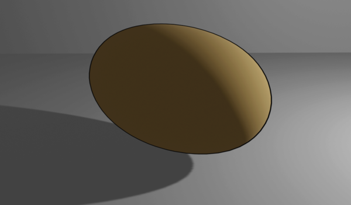

Add Outlines in Blender
======================

The addon allows you to add NPR/Cartoonish outlines in one click.

Unlike Freestyle, this method works in eevee as well as cycles engine.

## How to

Edit -> Preferences -> Addon -> Install and select `add_outline.py`. After its installed,
enable it and in the addon settings select the path for `toon_outline.blend`.

After this, you can select multiple objects and go Object->Add Outline. 

## What does it do:

The addon will add a solidify modifier to an object with some additional settings.
Then it will add a material only to this solidified section. The material will be transparent
except for the edges which will show up as an outline.